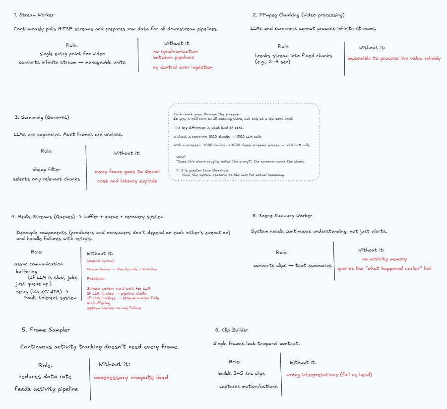

# Vigilens System Architecture


Vigilens is a real-time video intelligence platform that ingests RTSP streams, filters activity with fast screening, verifies events with Gemini, stores searchable memory in SQLite, and exposes a query API for event and activity recall.

## 1. Architecture Diagram

### 1.1 End-to-End System View


The system view captures the service boundaries and control plane of Vigilens.

Core boundaries:

- Ingestion boundary:
    - RTSP cameras feed `StreamProcessWorker`.
    - FFmpeg creates deterministic chunk files for downstream screening.
- Real-time decision boundary:
    - Fast screening decides whether a chunk should be escalated to deep LLM analysis.
    - Screening is optimized for throughput, not final semantic certainty.
- Verification boundary:
    - `LLMAnalysisWorker` performs high-accuracy event confirmation using Gemini structured outputs.
    - Verified detections are persisted as event memory and optionally sent via webhook.
- Activity memory boundary:
    - Scene branch independently builds short clips and produces timeline summaries.
    - This branch stays decoupled from event verification to avoid cross-pipeline blocking.
- Query boundary:
    - API query endpoint routes user intent to either event memory (`events`) or activity memory (`scene_timeline`).

Data ownership by component:

- Redis Streams own transient work state and worker handoff.
- SQLite owns durable memory state and queryable history.
- MinIO/S3 owns binary media objects and clip references.

Reliability model visible in this view:

- Workers are horizontally scalable and queue-driven.
- Message reclaim (`XAUTOCLAIM`) handles abandoned work.
- Event dedupe protects correctness under retries/reclaims.

### 1.2 Pipeline and Dataflow View


The pipeline view shows execution order and asynchronous fan-out.

Primary event pipeline (detection path):

1. `POST /streams/submit` creates a stream job and persists queued state.
2. Stream worker dequeues from `stream.jobs`, starts segmenter, and screens chunks.
3. Relevant chunks are uploaded to MinIO and enqueued to `llm.jobs`.
4. LLM worker verifies action semantics with Gemini.
5. Verified items are written to `events` (one row per detected item).
6. Webhook notifications are sent with retry semantics.

Parallel activity pipeline (timeline path):

1. Stream worker samples frames in memory from each chunk window.
2. Clip builder creates short scene clips and uploads to MinIO.
3. Scene jobs are enqueued to `scene.jobs` asynchronously.
4. Scene worker summarizes clip activity.
5. Summaries are persisted to `scene_timeline`.
6. Retention compaction summarizes old timeline rows.

Query pipeline:

1. `POST /query` accepts natural language + optional `camera_id`.
2. Rule-based router classifies into `event` or `activity` domain.
3. Domain SQL query executes over last-hour default window.
4. API returns normalized response shape with `source`, `timestamp`, `camera_id`, `summary`, `clip_url`, and optional `confidence`.

Pipeline invariants:

- `camera_id` and `clip_url` are propagated wherever available.
- Event and activity branches are independent and non-blocking.
- LLM never processes full unbounded streams, only selected clips/chunks.
- Durable memory is always SQLite-backed, not queue-backed.

### 1.3 Design Decision Snapshot



## 2. Codebase Layout

```text
vigilens/
    apps/
        api/
            app.py                 FastAPI app, router wiring, startup DB init
            stream.py              Stream submission and stream status API
            query.py               Query endpoint and normalized query response
        workers/
            stream/
                stream.py            FFmpeg segmenter and chunk readiness probe
                worker.py            Main stream worker: screening + llm enqueue + scene enqueue
            llm/
                worker.py            Gemini verification worker, event persistence, webhooks
                webhook.py           Retrying webhook delivery
            scene/
                worker.py            Scene summary worker for activity timeline
    core/
        config.py                Central runtime configuration
        db.py                    SQLite schema, persistence, query helpers, retention compression
    integrations/
        redis_queue.py           Redis Streams wrapper with stale message recovery
        storage.py               S3/MinIO upload and presigned URL generation
        llm_client.py            Gemini + compatibility LLM integration logic
    models/contracts/
        messages.py              StreamJobMessage, LLMJobMessage, SceneJobMessage
        prompts.py               Prompt templates and response schemas
    services/
        screening.py             Fast screening callouts
        clip_builder.py          In-memory frame sampling and clip construction
        events.py                Event/timeline persistence and query services
        query_router.py          Rule-based query routing (event vs activity)
```

## 3. Runtime Components

### 3.1 API Service

- FastAPI application in `apps/api/app.py`.
- Startup lifecycle runs `init_db_async()`.
- Exposes:
    - `POST /streams/submit` to enqueue stream processing jobs.
    - `GET /streams/{stream_id}` for stream status lookup.
    - `POST /query` for memory-backed retrieval.
    - `GET /health` for liveness.

### 3.2 Stream Worker

The stream worker does three things in parallel-safe fashion:

1. Ingests RTSP with FFmpeg into short MP4 chunks.
2. Screens chunks using the fast reranker (`services/screening.py`).
3. Branches output:
     - High-confidence chunks -> upload to MinIO -> enqueue `llm.jobs`.
     - In-memory sampled scene clip -> upload to MinIO -> enqueue `scene.jobs`.

Important behavior:

- Uses staging directory cleanup to control disk growth.
- Acks stream queue messages after processing callback completion.
- Updates stream status in SQLite (`processing`, `completed`, `failed`).

### 3.3 LLM Worker

- Consumes `llm.jobs`.
- Calls Gemini structured output analysis through `integrations/llm_client.py`.
- Parses/validates to `VideoAnalysisResultList`.
- Persists one row per detected item into `events` table before webhook dispatch.
- Uses idempotency guard (`dedupe_key`) to avoid duplicate event writes when jobs are reclaimed/retried.

### 3.4 Scene Worker

- Consumes `scene.jobs`.
- Generates lightweight scene summary via Gemini clip summarization.
- Persists into `scene_timeline`.
- Periodically compacts old timeline rows by calling retention compression.

## 4. Data Stores and Queue Topology

### 4.1 Redis Streams

Queues:

- `stream.jobs`: input stream processing jobs
- `llm.jobs`: deep verification jobs
- `scene.jobs`: activity summary jobs

Consumer groups use reclaim logic:

- pending self-recovery (`XREADGROUP` with `0`)
- stale claim (`XAUTOCLAIM` via `claim_stale_ms`)
- fresh messages (`XREADGROUP` with `>`)

This makes the pipeline resilient to worker crashes and restarts.

### 4.2 SQLite Schema

Tables are created in `core/db.py`.

```sql
CREATE TABLE streams (
    id TEXT PRIMARY KEY,
    url TEXT,
    status TEXT,
    camera_id TEXT,
    created_at DATETIME,
    updated_at DATETIME
);

CREATE TABLE events (
    id TEXT PRIMARY KEY,
    timestamp DATETIME,
    camera_id TEXT,
    event_type TEXT,
    confidence REAL,
    description TEXT,
    clip_url TEXT,
    stream_id TEXT,
    dedupe_key TEXT
);

CREATE INDEX idx_events_time ON events (camera_id, timestamp DESC);
CREATE UNIQUE INDEX idx_events_dedupe_key ON events (dedupe_key);

CREATE TABLE scene_timeline (
    id TEXT PRIMARY KEY,
    timestamp DATETIME,
    camera_id TEXT,
    summary TEXT,
    clip_url TEXT,
    stream_id TEXT,
    is_compacted INTEGER DEFAULT 0
);

CREATE INDEX idx_scene_time ON scene_timeline (camera_id, timestamp DESC);
```

## 5. Processing Pipelines

### 5.1 Event Detection Pipeline

1. Client submits stream to `POST /streams/submit`.
2. API writes initial stream record and enqueues `stream.jobs`.
3. Stream worker chunks + screens.
4. Selected chunks are uploaded and pushed to `llm.jobs`.
5. LLM worker verifies with Gemini.
6. Valid detections are persisted to `events`.
7. Webhooks are sent with retry.

### 5.2 Activity Timeline Pipeline

1. Stream worker samples frames in memory from chunk.
2. Builds short clip and uploads to MinIO.
3. Enqueues `scene.jobs` asynchronously (non-blocking to LLM path).
4. Scene worker summarizes clip.
5. Persists summary in `scene_timeline`.
6. Periodic compaction summarizes older rows.

### 5.3 Query Pipeline

1. Client sends `POST /query` with text and optional `camera_id`.
2. Query router classifies:
     - event keywords (`fall`, `accident`, `injury`, `alert`) -> `events`
     - otherwise -> `scene_timeline`
3. SQL query uses a 1-hour lookback default and result limits.
4. API returns normalized response rows:
     - `source` (`event` or `activity`)
     - `timestamp`
     - `camera_id`
     - `summary`
     - `clip_url`
     - `confidence` (events only)

## 6. Contracts

Primary contracts in `models/contracts/messages.py`:

- `StreamJobMessage`
    - `stream_id`, `tenant_id`, optional `camera_id`, `rtsp_url`, chunk settings, queries, thresholds
- `LLMJobMessage`
    - `stream_id`, optional `camera_id`, chunk references, optional `clip_url`, queries, thresholds
- `SceneJobMessage`
    - `stream_id`, optional `camera_id`, `clip_url`, screening metadata

Primary LLM structured output schema in `models/contracts/prompts.py`:

- `VideoAnalysisResultList`
    - list of `VideoAnalysisResult` items
    - each item carries analysis/title/identifiers/frame refs/action flags

## 7. Reliability and Hardening

### 7.1 Idempotent Event Writes

`services/events.py` computes deterministic `dedupe_key` from stream, camera, clip URL, query, and item payload. `events` has a unique index on `dedupe_key`.

Result: retries and reclaimed messages do not duplicate event rows.

### 7.2 Worker Crash Resilience

`integrations/redis_queue.py` supports stale message claiming through `XAUTOCLAIM`, allowing healthy workers to recover orphaned jobs.

### 7.3 Resource Safety

- Chunk staging cleanup in stream worker.
- In-memory frame sampling avoids per-frame disk dump explosion.


The architecture is queue-centric, SQL-memory backed, and optimized for real-time surveillance/event workflows.
