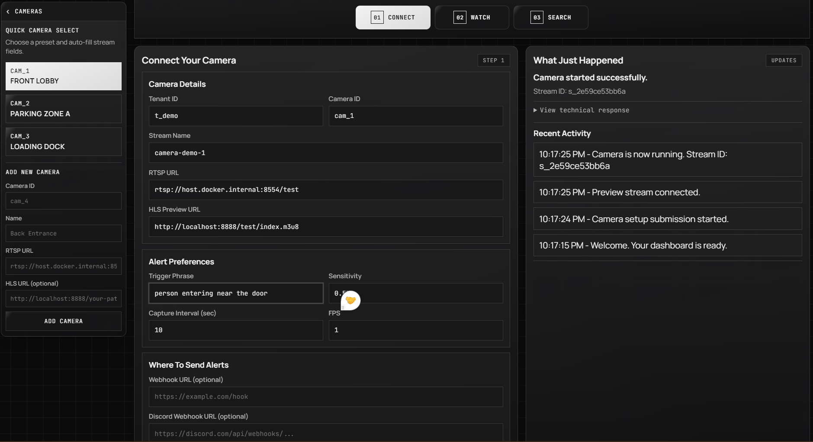
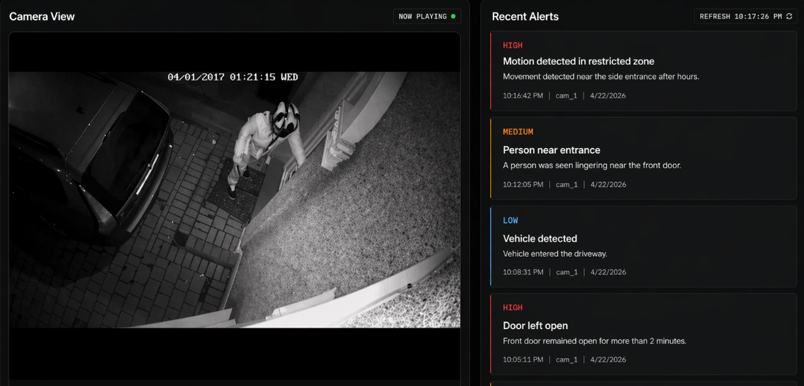
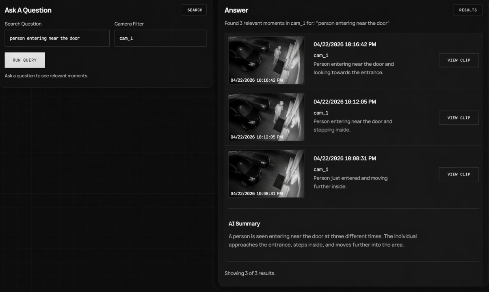
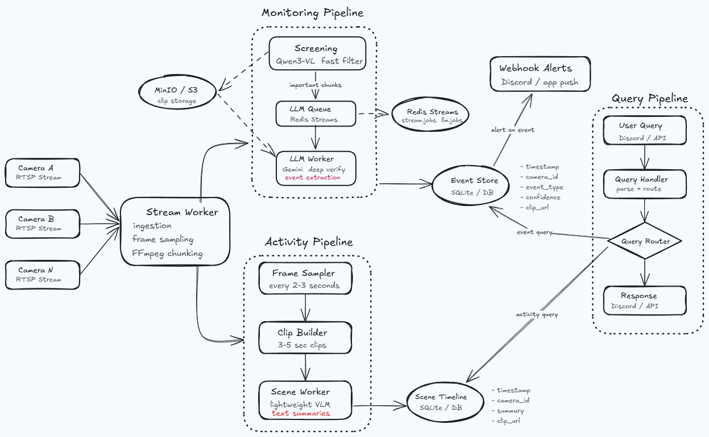
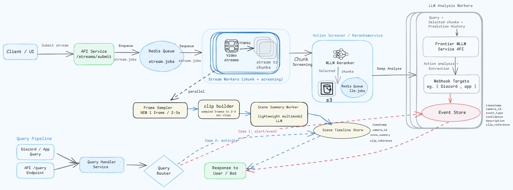

# Vigilens

Vigilens is a real-time video intelligence system for always-on RTSP streams.

It combines a fast screening pipeline, deep Gemini verification, durable memory in SQLite, and a query API so the system is not only alerting in real time but also searchable after the fact.

## What Vigilens Does

- Monitors live RTSP streams continuously.
- Detects user-defined events from natural language trigger queries.
- Sends webhooks with clip context on verified detections.
- Stores event memory and activity timeline in SQLite.
- Supports natural-language query over recent events and activities.


## DEMO


### System configuration:
- Configure streams, triggers, and processing parameters for each camera source.

- Manage thresholds, query rules, and system behavior for reliable real-time monitoring.



### Streaming view:

- Live CCTV feed with real-time event detection and prioritized alert stream.

- Highlights critical activities with severity levels, timestamps, and quick clip access.




### Query history:

- Natural language search over video streams to retrieve relevant moments instantly.

- Returns timestamped clips with concise descriptions and an aggregated AI summary.




## Architecture

For full technical documentation, see [ARCHITECTURE.md](ARCHITECTURE.md).

System view:



Pipeline view:



## Core Pipelines

### 1) Event Detection Pipeline

1. `POST /streams/submit` enqueues stream jobs.
2. Stream worker chunks RTSP and screens chunks.
3. Relevant chunks are uploaded and enqueued to `llm.jobs`.
4. LLM worker verifies events with Gemini structured output.
5. Verified detections persist to `events` table.
6. Webhooks are sent with retry.

### 2) Activity Timeline Pipeline

1. Stream worker samples frames in memory.
2. Clip builder creates short clips and uploads to MinIO.
3. Scene jobs are enqueued to `scene.jobs`.
4. Scene worker summarizes clips.
5. Summaries persist to `scene_timeline`.

### 3) Query Pipeline

1. `POST /query` accepts user query + optional camera filter.
2. Query router chooses `event` or `activity` path.
3. SQLite returns recent rows with clip references.
4. API returns normalized results.

## Quick Start (Local)

### Prerequisites

- Python 3.11+
- FFmpeg + FFprobe on PATH
- Redis
- S3-compatible object storage (for example MinIO)
- Screener endpoint (Qwen3-VL reranker service)
- Gemini API key

### 1) Install

```bash
python -m venv env
# Windows
env\Scripts\activate
# macOS/Linux
# source env/bin/activate

pip install -e .
pip install -e ".[test]"
```

### 2) Configure Environment

```bash
cp .env.example .env
```

Set at least:

- `REDIS_URL`
- `S3_ENDPOINT`
- `S3_BUCKET`
- `AWS_ACCESS_KEY_ID`
- `AWS_SECRET_ACCESS_KEY`
- `SCREENER_BASE_URL`
- `SCREENER_API_KEY`
- `LLM_API_KEY`

Recommended defaults are managed via `vigilens/core/config.py`.

### 3) Initialize DB

```bash
make db-init
```

### 4) Run Services

In separate terminals:

```bash
make api
make stream-worker
make llm-worker
make scene-worker
```

### 5) Submit a Stream

```bash
curl -X POST http://localhost:8000/streams/submit \
  -H "Content-Type: application/json" \
  -d '{
    "name": "demo-stream",
    "camera_id": "cam_1",
    "rtsp_url": "rtsp://example.local/live",
    "trigger_queries": [
      {"query": "person falling", "threshold": 0.55},
      {"query": "fire", "threshold": 0.70}
    ],
    "webhook_urls": ["https://example.com/webhook"],
    "chunk_seconds": 10,
    "fps": 1
  }'
```

### 6) Query Memory

```bash
curl -X POST http://localhost:8000/query \
  -H "Content-Type: application/json" \
  -d '{
    "query": "did someone fall",
    "camera_id": "cam_1"
  }'
```

## API Reference

### `POST /streams/submit`

Creates and enqueues a stream processing job.

Request:

```json
{
  "tenant_id": "t_123",
  "camera_id": "cam_1",
  "name": "front-door",
  "rtsp_url": "rtsp://example.local/live",
  "trigger_queries": [{"query": "person falling", "threshold": 0.55}],
  "webhook_urls": ["https://example.com/webhook"],
  "chunk_seconds": 10,
  "fps": 1,
  "video_target_width": 640,
  "video_target_height": 360
}
```

### `GET /streams/{stream_id}`

Returns stream status from SQLite.

### `POST /query`

Queries event/activity memory.

Request:

```json
{
  "query": "did someone fall",
  "camera_id": "cam_1"
}
```

Response:

```json
{
  "route": "event",
  "results": [
    {
      "source": "event",
      "timestamp": "2026-04-15 12:00:00",
      "camera_id": "cam_1",
      "summary": "person fell near stairs",
      "clip_url": "https://...",
      "confidence": 1.0
    }
  ]
}
```

## Data Model Summary

SQLite tables:

- `streams`: stream lifecycle state (`queued`, `processing`, `completed`, `failed`)
- `events`: verified event memory with dedupe key
- `scene_timeline`: activity summary memory with compaction support

## Reliability Features

- Redis Streams consumer groups for queue-based isolation.
- Stale message reclaim (`XAUTOCLAIM`) for crash recovery.
- Event idempotency guard (`dedupe_key`) to avoid duplicate inserts.
- Worker staging cleanup to control disk growth.
- In-memory frame sampling for scene branch (no frame dump files).

## Testing

Always run tests on the active venv:

```bash
uv run --active pytest
```

Targeted runs:

```bash
make test-unit
make test-integration
make test-contract
```

## Notes

- The reranker service is designed for deployment on Modal; see `vigilens/reranker/README.md`.
- For architecture-level details and diagrams, see [ARCHITECTURE.md](ARCHITECTURE.md).

